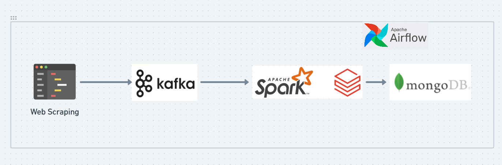

# RealEstate_Data_Engineering

This project builds an end-to-end data pipeline to gather, process, and store real estate data from CommonFloor.com. Leveraging web scraping, Kafka, PySpark, MongoDB, and Airflow, it extracts valuable insights from real estate listings in a streamlined, automated workflow.

## Project Overview

The data pipeline consists of the following stages:

1. Data Collection: Web scraping is used to extract real estate listings from CommonFloor.com. This data includes property details such as location, price, size, and other relevant attributes.\n
2. Data Streaming: The scraped data is serialized and sent to Confluent Kafka in real-time for efficient, scalable data ingestion.
3. Data Processing: PySpark reads the Kafka stream, processes the data, and prepares it for storage. This step may include transformations, filtering, and enrichment of the raw data.
4. Data Storage: The processed data is stored in MongoDB, where it can be accessed and queried for further analysis or reporting.
5. Workflow Orchestration: Airflow orchestrates each stage of the pipeline, ensuring smooth data flow from scraping to storage. The entire pipeline is triggered and managed using Airflow, allowing for scheduled data updates and monitoring.



## Key Technologies

1. Web Scraping: BeautifulSoup and requests for data extraction from CommonFloor.com.
2. Data Streaming: Confluent Kafka for scalable data streaming.
3. Data Processing: PySpark for stream processing and data transformation.
4. Data Storage: MongoDB as a NoSQL database for structured and unstructured data storage.
5. Orchestration: Apache Airflow to manage the pipeline and automate data workflows.

## Pre-requisites

Essential Folders:

logs/: For storing Airflow logs.
plugins/: For any Airflow plugins.
config/: For storing configuration files needed by Airflow.
dags/.env/: For securely storing credentials, such as Confluent Kafka and MongoDB authentication details, along with the Kafka topic name.
Docker and Docker Compose: Ensure these are installed to run Airflow.
Docker Service Naming: Avoid using underscores (_) in Docker service names, as they may cause issues with Airflow connections.
MongoDB: Set up MongoDB for data storage.

## Running the Pipeline

1. Build Docker Containers (First-Time Setup Only):

```
docker-compose build
```

2. Start the Services:

Start all services, including Airflow, Kafka, and any other dependencies.

```
docker-compose up -d
```

3. Access the Airflow Web UI:

Once the services are running, access the Airflow UI to monitor and trigger the DAGs.

Default URL: http://localhost:8080
Trigger the Pipeline:

In the Airflow UI, locate and trigger the DAG associated with this pipeline.
This will start the sequence of tasks, from scraping to processing and storing data in MongoDB.
Stop the Services (When Done):

```
docker-compose down
```

4. Rebuild (If Necessary):

If you make changes to the Docker configuration, rebuild the containers:

```
docker-compose build
```